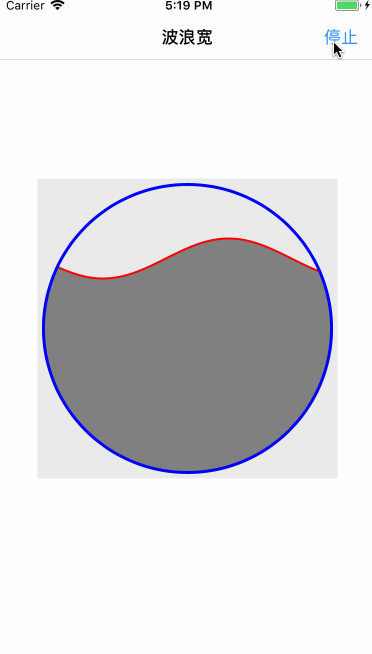

# ZZWaterWave

### 实现思路
1. 定义一个View，并增加圆形或者自定义背景视图
2. 画出静态正弦函数
3. 遮罩，mask层
4. 定时器，不断的改变路径上的各个点，让波浪动起来

### iOS运行效果图

### 难点
三角函数：假设  **y = Asin（ωx+φ）+ C**
 
> A 表示振幅，也就是使用这个变量来调整波浪的最大的高度
> ω 与周期相关，周期 T = 2 x pi / ω 即这个变量用来调整同宽度内显示的波浪的数量
> φ 表示波浪横向的偏移，**也就是使用这个变量来调整波浪的流动**
> C 表示波浪纵向偏移的位置。

如果你的三角函数还给了敬爱的老师，我在网上大概找了一下比较详细的教程可以参考下：

- [正弦函数伸缩变换](https://wenku.baidu.com/view/beda69870029bd64783e2c28.html)  
- [三角函数平移变换和周期变换](https://wenku.baidu.com/view/3ecdb3f0b0717fd5360cdc80.html)

详细过程请参考简书：[【iOS】绘画波浪篇](http://www.jianshu.com/p/0e304b3cc448) 
